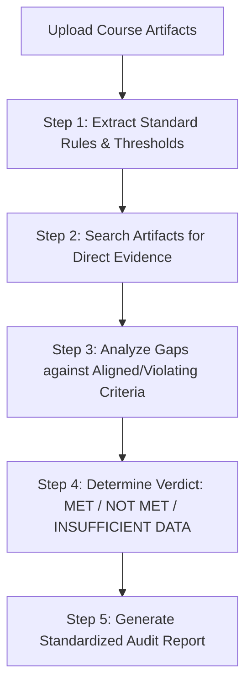

# OQRA — Online Quality Review Assistant 🤖📚

**OQRA (Online Quality Review Assistant)** is an AI-powered diagnostic system prompt framework designed to evaluate online and hybrid course artifacts against quality assurance standards. 

Engineered with a **zero-assumption diagnostic pipeline**, OQRA minimizes AI hallucinations and ensures evidence-based, audit-ready evaluations of syllabi, course maps, lesson modules, and assessment prompts.

---

## 📋 Table of Contents
- [Key Features](#-key-features)
- [Diagnostic Pipeline Architecture](#-diagnostic-pipeline-architecture)
- [Knowledgebase & Rubric Framework](#-knowledgebase--rubric-framework)
- [Repository Structure](#-repository-structure)
- [Getting Started](#-getting-started)
  - [Deployment Options](#deployment-options)
  - [Usage Workflow](#usage-workflow)
- [Standardized Output Schema](#-standardized-output-schema)
- [Versioning & Changelog](#-versioning--changelog)
- [Contributing](#-contributing)
- [License](#-license)

---

## ✨ Key Features

* **Strict Evidence Grounding:** Eliminates guesswork and hallucinations by enforcing pure zero-assumption diagnostic rules.
* **5-Step Diagnostic Protocol:** Executes a sequential evaluation algorithm (Standard Extraction $\rightarrow$ Evidence Gathering $\rightarrow$ Gap Analysis $\rightarrow$ Verdict Determination $\rightarrow$ Reporting).
* **Standard ID Indexing:** Native tracking and reporting using granular standard codes (e.g., `GR-S1.1` to `GR-S8.7` for Green standards, `GO-S4.6` to `GO-S7.5` for Gold standards).
* **Objective Verdict Thresholds:** Categorizes compliance using strict passing thresholds (`MET`, `NOT MET`, `INSUFFICIENT DATA`).
* **Actionable Instructional Design Advice:** Generates precise recommendations whenever a course artifact fails or lacks documented proof for a standard.

---

## ⚙️ Diagnostic Pipeline Architecture

OQRA operates using a structured 5-step diagnostic loop to evaluate course artifacts:

> 1. **Rule Extraction:** Pulls exact standard summaries, passing thresholds, scope, and criteria from the knowledgebase.  
> 2. **Evidence Gathering:** Extracts direct quotes, page numbers, and module locations from uploaded course files.  
> 3. **Gap & Compliance Analysis:** Cross-references course evidence against required elements and known violating examples.  
> 4. **Verdict Determination:** Assigns an objective status based on strict threshold compliance.  
> 5. **Diagnostic Reporting:** Renders a clean, structured audit report complete with evidence and actionable recommendations.

---

## **📖 Knowledgebase & Rubric Framework**

OQRA is powered by the **OQRA Knowledgebase v2.0**, built on the [USF Green & Gold Rubrics](https://www.usf.edu/innovative-education/digital-learning/digital-learning-design/design-process/commitment-to-excellence.aspx) covering 50 specific review standards across 8 primary General Standards:

| General Standard | Category | Key Focus Areas |
| :---- | :---- | :---- |
| **GS 1** | Course Overview & Introduction | Getting started guides, structure, policies, technology requirements |
| **GS 2** | Learning Outcomes | Measurability (Bloom's), level-appropriateness, explicit alignment |
| **GS 3** | Assessment & Measurement | Outcome measurement, grading policy clarity, descriptive criteria, integrity |
| **GS 4** | Instructional Materials | Alignment, preparation relevance, copyright modeling, currency |
| **GS 5** | Learning Activities & Interaction | Active learning, interaction plans (RSI), community building, application |
| **GS 6** | Course Technology | Objective support, active engagement tools, data privacy protection |
| **GS 7** | Learner Support | Technical, accessibility, academic, and student services integration |
| **GS 8** | Accessibility & Usability | Navigation, readability, accessible text/images/media, vendor VPATs |

---

## **📁 Repository Structure**

Plaintext  
oqra/  
├── README.md                           \# Master repository documentation  
├── LICENSE                             \# License file (MIT)  
├── system\_prompts/  
│   ├── oqra\_system\_prompt\_v2.0.md      \# Production system prompt  
│   └── oqra\_system\_prompt\_v1.0.md      \# Legacy prompt (archived)  
└── knowledgebase/  
    ├── oqra\_knowledgebase\_v2.0.md  \# Primary Markdown knowledgebase  
    └── schema\_templates/               \# Output JSON/Markdown schemas

---

## **🚀 Getting Started**

### **Deployment Options**

OQRA's system prompt and knowledgebase can be deployed in multiple environments:

#### **1\. Gemini Gems / Custom GPTs**

> 1. Copy the contents of system\_prompts/oqra\_system\_prompt\_v2.0.md into the **Instructions** / **System Prompt** field.
> 2. Build your own knowledgebase file by modifying either knowledgebase/oqra\_knowledgebase\_v2.0.md or oqra\_knowledgebase\_schema.md and upload it as **Knowledgebase Files**.

#### **2\. LLM API / System Message Integration**

Inject the system prompt into your API call payload (e.g., Gemini API, OpenAI API, Anthropic Claude API) alongside your rubric context.

### **Usage Workflow**

> 1. Start a session with OQRA.  
> 2. Upload course documentation (e.g., Syllabus.pdf, Course\_Map.xlsx, or LMS module exports).  
> 3. Query OQRA by referencing specific standards or asking general audit questions:  
   * *"Evaluate GR-S3.2 for the uploaded syllabus."*  
   * *"Audit General Standard 1 across all provided files."*  
   * *"Check if the course meets the requirements for GR-S2.1."*

---

## **📊 Standardized Output Schema**

OQRA outputs diagnostic evaluations using a consistent format:

Markdown  
\#\#\# \[Standard ID\]: \[Standard Title/Summary\]  
\* **\*\*Category\*\***: \[Category Name\]  
\* **\*\*Rubric Type\*\***: \[Green / Gold\] | **\*\*Points\*\***: \[Xpts\] | **\*\*Priority Weight\*\***: \[High/Medium/Low\]  
\* **\*\*Evaluation Status\*\***: **\*\*\[MET | NOT MET | INSUFFICIENT DATA\]\*\***

\#\#\#\# 1\. Evidence & Findings  
\* \[Direct citation or quote from uploaded documents supporting the finding, referencing file name/location\]  
\* \[Clear explanation of how the evidence satisfies or fails the Passing Threshold\]

\#\#\#\# 2\. Diagnostic Analysis & Gaps  
\* \[Brief analysis comparing course design against Aligned Elements or Violating Examples\]

\#\#\#\# 3\. Actionable Recommendations (Required if NOT MET or INSUFFICIENT DATA)  
\* \[Specific, step-by-step instructional design advice to align the course with rubric criteria\]

---

## **🔄 Versioning & Changelog**

This project uses [Semantic Versioning](https://semver.org/).

### **v2.0.0 (Current Version)**

* 🚀 **Diagnostic Protocol:** Added an explicit 5-step evaluation algorithm to eliminate non-grounded outputs.  
* 🏷️ **ID Tracking:** Integrated explicit GR-S\#.\# and GO-S\#.\# indexing across all rubrics.  
* 📏 **Character Constraint Removal:** Removed rigid character caps that led to cut-off citations and incomplete feedback.  
* 📑 **Schema Normalization:** Added standardized outputs for seamless downstream automation.

---

## **🤝 Contributing**

Contributions to refine prompt engineering techniques, add test cases, or expand knowledgebase schema formats are welcome\!

> 1. Fork the Repository.  
> 2. Create your Feature Branch (git checkout \-b feature/PromptEnhancement).  
> 3. Commit your Changes (git commit \-m 'Refine GR-S3.1 diagnostic rules').  
> 4. Push to the Branch (git checkout \-b feature/PromptEnhancement).  
> 5. Open a Pull Request.

---

## **📜 License**

Distributed under the **MIT License**. See LICENSE for details.
